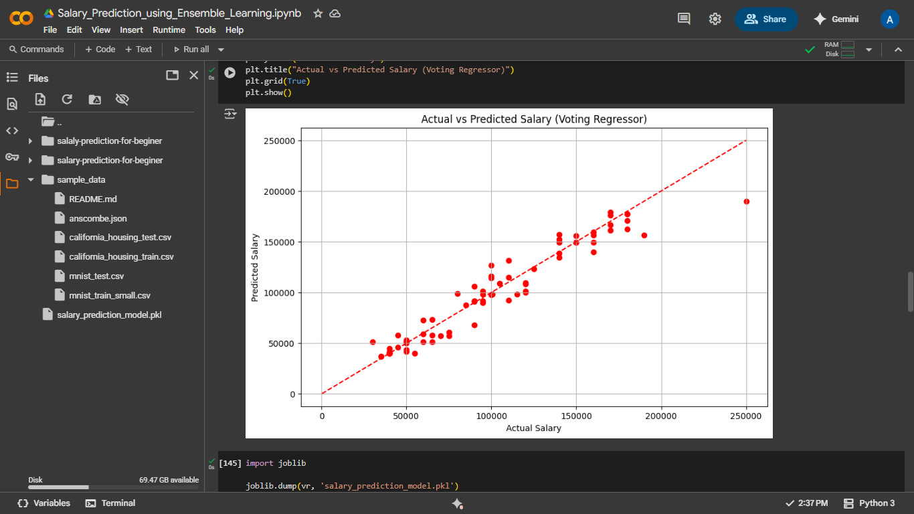
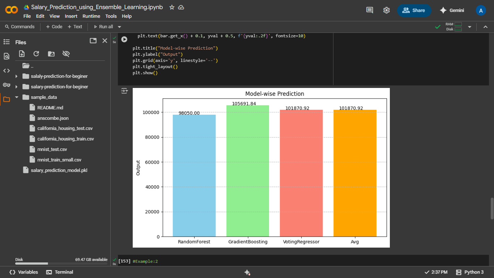
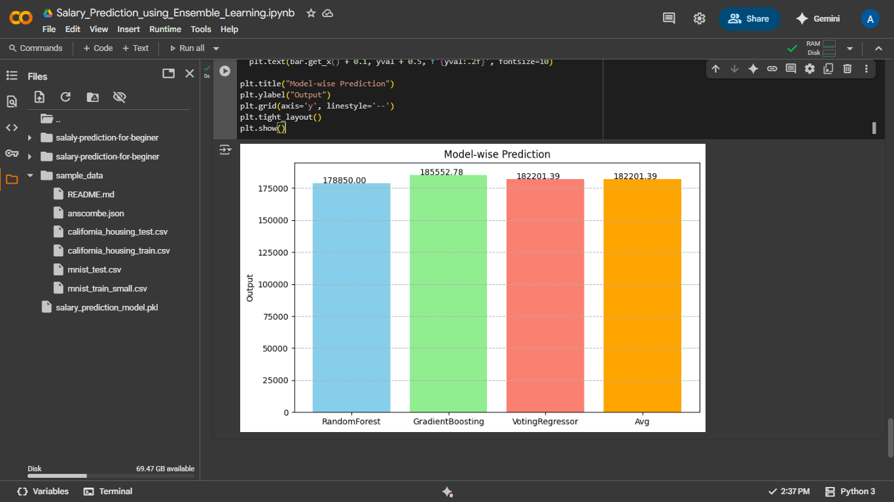

# 💼 Salary Prediction using Ensemble Learning

This repository showcases a **Salary Prediction** project developed as part of the **PBEL (Project Based Experiential Learning)** internship at **IBM** by **Anshika Raj**. The project aims to predict salaries using powerful ensemble learning techniques.

---

## 👩‍💻 About Me

- **Name:** Anshika Raj  
- **Internship:** IBM – PBEL (Project Based Experiential Learning)  
- **Course:** B.Tech in Computer Science and Engineering (Artificial Intelligence)  
- **College:** SR Institute of Management and Technology, Lucknow  
- **University:** Dr. A.P.J Abdul Kalam Technical University, Lucknow

---

## 🚀 Project Overview

The goal of this project is to build a machine learning model that can accurately predict salaries based on input features like age, education, experience, and job title using various ensemble techniques:

- **Random Forest Regressor**
- **Gradient Boosting Regressor**
- **Voting Regressor**

---

## 📁 Dataset

- Dataset Source: [Kaggle – Salary Prediction for Beginners](https://www.kaggle.com/datasets/rkiattisak/salaly-prediction-for-beginer)
- Downloaded using the `opendatasets` library.
- Preprocessing involved:
  - Handling **missing values**
  - **Label Encoding** categorical variables (`Gender`, `Education Level`, `Job Title`)
  - Feature-target separation into **X** and **y**

---

## 🛠️ Libraries Used

- `pandas`, `numpy`
- `matplotlib.pyplot`, `seaborn`
- `sklearn.model_selection`
- `sklearn.preprocessing.LabelEncoder`
- `sklearn.ensemble`
- `sklearn.metrics`
- `joblib` (for saving the model)
- `opendatasets` (to access the dataset from Kaggle)

---

## 🧠 Model Training & Evaluation

Three ensemble models were trained on the dataset:

1. **RandomForestRegressor**
2. **GradientBoostingRegressor**
3. **VotingRegressor** – Combined predictions from the above two models.

Performance was measured using:

- `R² Score`
- `Mean Squared Error`

```python
print("Random Forest R2 score: ", r2_score(y_test, rf_pred))
print("Gradient Boosting R2 score: ", r2_score(y_test, gb_pred))
print("Voting Regressor R2 score: ", r2_score(y_test, vr_pred))
````

---

## 📈 Visualization

### 1. Actual vs Predicted Salary (Voting Regressor)



### 2. Model-wise Salary Prediction Comparison

For sample inputs, predictions from all three models and their average were compared using bar plots:




---

## 💾 Model Saving

The best-performing ensemble model (`VotingRegressor`) was saved using `joblib`:

```python
joblib.dump(vr, 'salary_prediction_model.pkl')
```

---

## 🧪 Prediction Examples

### Example 1:

```python
new_data = np.array([[26, 3, 1, 4, 90]])
```
#### Output of Example 1:

```python
Predicted Salary: 101870.91822920856
```
### Model Graph of Example 1


### Example 2:

```python
new_data = np.array([[100, 10, 80, 90, 80]])
```
#### Output of Example 1:

```python
Predicted Salary: 182201.3905342675
```
### Model Graph of Example 2


Predicted salaries were displayed and visualized for both.

---

## 🔮 Future Enhancements

* Incorporating more advanced feature engineering
* Hyperparameter tuning with GridSearchCV
* Deploying the model via Flask/Streamlit
* Integrating deep learning approaches

---

## 📌 How to Run

1. Clone this repo.
2. Open the Jupyter/Colab Notebook.
3. Install requirements:

```bash
pip install opendatasets
```

4. Run the notebook and follow along with the training, evaluation, and prediction steps.

---

## 📜 License

This project is for academic and learning purposes under the [MIT License](LICENSE).

---

## 🙋‍♀️ Acknowledgment

This project was developed as part of the **PBEL Internship Program at IBM**.
Special thanks to the mentors and faculty of SR Institute of Management and Technology, Lucknow.

---

> Made with ❤️ by **Anshika Raj** | IBM PBEL Intern | CSE(AI) | AKTU
